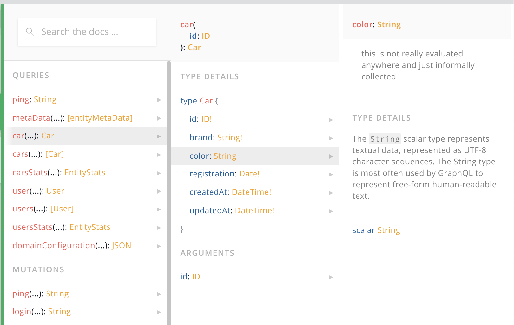

# Attribute Configuration

Entities have attributes describing the data of the entity. You can define its aspects by the this configuration type, in YAML, JSON or a configuration object. In the following examples we will prefer YAML and use a configuration object only when necessary.  

### Configuration Type

```typescript
export type AttributeConfig = {
  type?:string;
  required?:boolean
  unique?:boolean|string
  description?:string
  list?:boolean
  defaultValue?:any|(( attributes:any, runtime:Runtime)=>any|Promise<any>)
  filterType?:string|false
  validation?:object
  resolve?:(arc:AttributeResolveContext) => any
  virtual?:boolean
  mediaType?:'image'|'video'|'audio'
}
```

All configuration options are documented in detail further below: 

| parameter | type | purpose |
| - | - | - |
| [type](#type)                 |  string           | type of attribute values, can be any GraphQL or ActiveQL scalar or any of your defined enums |
| [required](#required)         | boolean           | mandatory attribute value; adds schema and business validations for non-null values |
| [unique](#unique)             | boolean           | uniqueness of value; adds business validation for unique values, also within a scope |
| [list](#list)                 | boolean           | list of scalar types |
| [defaultValue](#defaultValue) | any or Function   | static or dynamic default values for new entity items |
| [filterType](#filterType)     | string or boolean | disable or change filter behaviour for attributes |
| [description](#description)   | string            | adding documentaton to the public API / schema | 
| [validation](#validation)     | object            | configure business validation using extensive ValidateJS syntax |
| [resolve](#resolve)           | Function          | callback to determine custom value for a field that will be send to a client |
| [virtual](#virtual)           | boolean           | non-persistant value; value is never written or read from datastore |
| mediatype                     |  string           | only used as metadata for UI clients, e.g. ActiveQL Admin UI |

 <br>

### Shortcut Notation

Instead of providing the configuration object you can skip everything and just write the type as value for the attribute instead.  The rest of the attribute configuration object would then be set as default.  You can even use all type shortcut notations (such as `String!` or `Key` as described below) when using this. The follwing examples are equivalant:

<table width="100%" style="font-size: 0.9em">
<tr valign="top"><td width="50%"> Shortcut </td><td width="50%"> Similar notation </td></tr>
<tr valign="top"><td width="50%">


entity:
  Car: 
    attributes:
      brand: String!
      mileage: Int
      licence: Key



</td>
<td width="50%">


entity:
  Car: 
    attributes:
      brand: 
        type: String
        required: true
      mileage: 
        type: Int
      licence: 
        type: String
        required: true
        unique: true    


</td>
</tr>
</table>

---
## type

```typescript
type?:string
```

The type of an attribute can be any Enum, Object or Scalar type described as follows. Note that you should not use the object type of another entity as an attribute type but instead describe the relations between entities as [associations](./entity-associations.md). 

#### **Shortcut Notation**

The most common attribute configurations can be done by via shortcut notation: 

| Value       | Description  |
| ----------- | ------------ |
| Key         | sets the type to `String`, `required` and `unique` to `true` |
| typeName!   | sets the type to 'typeName' and `required` to true, e.g. `Int!` becomes `{ type: 'Int, required: true}` |
| [typeName]  | sets type to 'typeName' and `list` to `true`, e.g. `Int!` becomes `{ type: 'Int, list: true}` |
| [typeName!] | sets type to 'typeName' and `list` and `required` to `true` |

<br>

#### **GraphQL scalar type**

You can use any GraphQL scalar type. Check also [GraphQL Type System](https://graphql.org/learn/schema/#type-system)

| Value       | Description                                         |
| ----------- | --------------------------------------------------- |
| Int         | A signed 32‐bit integer.                            |
| Float       | A signed double-precision floating-point value.     |
| String      | A UTF‐8 character sequence.                         |
| Boolean     | true or false                                       |
| String      | A UTF‐8 character sequence.                         |
| ID          | represents a unique identifier, Although allowed it is advised not to use the `ID` type since ActiveQL uses this to identify entity items and establich relations between entities (think primary and foreign keys). |


#### **ActiveQL scalar types**

In addition to the GraphQL scalar types, ActiveQL provides the following types, that can be used as a type for an attribute.

| Value       | Description                                         |
| ----------- | --------------------------------------------------- |
| DateTime    | String representation of a Date in the JSON data it serializes to/from `new Date().toJSON()` internally it converts it to a Javascript Date object |
| Date        | String representation of a Date in simplified format `yyyy-mm-dd`; this type does not know about any timezones, it is merely a structured string, nonetheless sufficient in many situtaion when you don't care about timezones or complex date calculations. If you do, use `DateTime` instead. |
| JSON        | arbitrary JSON structure (you should use this with caution and prefer GraphQL types instead) |


#### **File**

ActiveQL provides a GrapqhQL type `File` that you can use as an attribute type, defined as follows.

```graphql
type File {
    filename: String!
    mimetype: String!
    encoding: String!
    secrect: String!
  }
```

To enable the upload of binary data you can use the following values for an attribute type:

| Value       | Description                                             |
| ----------- | ------------------------------------------------------- |
| File        | attribute to hold binary data (images, pdf etc)         |
| image       | short for `{ type: 'File', mediaType: 'image' }`        |
| video       | short for `{ type: 'File', mediaType: 'video' }`        |
| audio       | short for `{ type: 'File', mediaType: 'audio' }`        |

The `mediaType` property is only added to the metadata to be used by a UI client (e.g. ActiveQL Admin UI) to render the file accordingly.

Files can be uploaded via the GraphQL API. Therefore any attribute of the type "File" will add an input of type [GraphQLUpload](https://www.apollographql.com/docs/apollo-server/data/file-uploads/) to the create and update mutation (not the input type). 

The actual file will then be handled by an instance of `EntityFileSave` (e.g. written to a filesystem or stored in a database. 

The GraphQL API will not serve any binary file data though, this must be implemented by the actual application. The ActiveQL starter application writes any file to the local filesystem and serves it statically via ExpressJS. 

For details see [Handling Files](/activeql/handling-files).

#### **Enum**

An attribute can use any Enum type you add to the business domain configuration or directly to the schema.

| Value    | Description |
| -------- | ----------- |
| enumName | will take this (enum) if exists as type for this attribute |

---

### Attribute Type Example

In the following example you see the usage of possible type values and notations to describe a _Car_ entity.

<table width="100%" style="font-size: 0.9em">
<tr valign="top">
<td width="50%"> YAML Configuration </td> <td width="50%"> Similar possible object notatation </td>
</tr>
<tr valign="top"><td markdown="block">

```yaml
enum: 
  CarBrand:
    - Mercedes
    - Audi
    - Porsche
    - BMW

entity: 
  Car: 
    attributes: 
      brand: CarBrand
      licence: Key
      mileage: Int!    
      fuelConsumption: 
        type: Float
        required: true
      registration: Date
      hasHitch: Boolean
      repairProtocol: JSON
      registrationScan: image      
```

</td><td markdown="block">

```typescript
{
  enum: {
    CarBrand: { 
      MERCEDES: 'Mercedes', 
      AUDI: 'Audi', 
      PORSCHE: 'Porsche', 
      BMW: 'BMW' 
    }
  },
  entity: {
    Car: {
      attributes: {
        brand: { 
          type: 'CarBrand' 
        }, 
        license: { 
          type: 'String', 
          unique: true, 
          required: true 
        },
        mileage: { 
          type: 'Int', 
          required: true 
        },
        fuelConsumption: { 
          type: 'Float', 
          required: true 
        },
        registration: { 
          type: 'Date' 
        },
        hasHitch: { 
          type: 'Boolean' 
        },
        repairProtocol: { 
          type: 'JSON' 
        },
        registrationScan: { 
          type: 'File', 
          mediaType: 'image' 
        }
      }
    }
  }
}
```

</td></tr>
</table>

---
## required

```typescript
required?:boolean
```

| Value        | Shortcut        | Description                                                                    |
| ------------ | --------------- | ------------------------------------------------------------------------------ |
| **`false`**  | if not provided | no effect                                                                      |
| `true`       | attributeName!  | NonNull in entity object and create input type, `required` added to validation |


**Non-Null Field in Schema**

If you set the required modifier for an attribute to `true`, the corresponding field of the following types become a NonNull field in the GraphQL schema: 

* the entity object type 
* the input type for the _create mutation_

This means a client not providing a value for this field in a _create mutation_ would result in a GrapqhQL error. Since the "required-requirement" is part of the public API you can expect any client to handle this correctly.  If you prefer to send ValidationMessages (instead of throwing an error) when a client sends null-values for required fields in a create mutation, you can leave the `required` option to `undefined` or `false` and use an attribute validation instead.

Please be aware there will also be an error thrown by the GraphQL layer if a resolver does not provide a non-null value for a required attribute. As long as the data are only handled by the default mutations or the `EntiyAccessor`, this should never happen. But it could be the case if the data in the datastore are manipulated directly by a custom query or mutation  or external source.

**Attribute Validation**

In addition to the non-null schema field a _required validation_ is added to the validation of any `required` attribute. You might ask why, since the GraphQL layer would prevent any non-null value anyhow. This is only true for the _create mutation_. The input type for the _update mutation_ allows a client to only send the attributes that should be updated. So even the field for a `required` attribute in the _update input type_ allows a null-value - to leave it untouched. But now a client could erroneus send something like `{brand: null}` even if "brand" is a `required` attribute. 

In addition to this any custom mutation could (and should) use an entity to create or update entity items. These values are not "checked" by the GraphQL schema of course. Therefore before saving an entity item, all validations - incl. this required - validation must be met. 

**Meta Data**

The information will also be part of the MetaData and can therefore used by any UI client. E.g. the ActiveQL Admin UI uses this information to render a mandatory input field for this attribute.

### Required Example 

<table width="100%" style="font-size: 0.9em">
<tr valign="top">
<td width="50%">
  YAML
</td>
<td width="50%">
  Resulting Schema (excerpt)
</td>
</tr>
<tr valign="top"><td markdown="block">

```yaml
entity:
  Car: 
    attributes:
      brand: 
        type: String
        required: true
```

same as short

```yaml
entity:
  Car: 
    attributes:
      brand: String! 
```

</td><td markdown="block">

```graphql
type Car {
  id: ID!
  brand: String!
  createdAt: DateTime!
  updatedAt: DateTime!
}

input CarCreateInput {
  brand: String!
}
```

</td>
</tr>
</table>

<table width="100%" style="font-size: 0.9em">
<tr valign="top">
<td width="50%"> Request </td> <td width="50%"> Response </td>
</tr>
<tr valign="top"><td markdown="block">

```graphql
mutation{
  createCar( car: { } ){
    car{ id brand }
    validationViolations { attribute message }
  }
}
```

</td><td markdown="block">

```json
{
  "error": {
    "errors": [
      {
        "message": "Field \"CarCreateInput.brand\" of required type \"String!\" was not provided."
      }
    ]
  }
}
```

</td></tr>
</table>

---
## unique

```typescript
unique?:boolean|string
```


| Value               | Shortcut  |  Description                                                     |
| ------------------- | --------- | ---------------------------------------------------------------- |
| **false**           | (default) | no effect                                                        |
| true                |           | adding validation of uniqueness of this attribute to the entity  |
| [other attribute]   |           | adding validation of uniqueness of this attribute to the entity within the scope ot this attribute |
| [assocTo Name]      |           | adding validation of uniqueness within the scope of the assoc of this attribute to the entity |

If an attribute is declared as unique, a validation is added to check that no entity item with an equal value for this attribute exists. If it finds the input value not unique it adds a message to the `ValidationViolaton` return type.

If the attribute is not `required` - it would allow many null values though.

### Example

Let's assume we want to express the requirement that the licence number of a car should be unique. We could write

```yaml
entity: 
  Car: 
    attributes: 
      brand: String!
      licence: 
        type: String
        unique: true
```

<table width="100%" style="font-size: 0.9em">
<tr valign="top">
<td width="30%"> Request </td> <td width="70%"> Response </td>
</tr>
<tr valign="top"><td markdown="block">

Let's see what cars already exist. 

```graphql
query {
  cars { id brand licence }
}
```

</td><td markdown="block">

One car with the licence nr "HH-BO 2020" exists.

```json
{
  "data": {
    "cars": [
      {
        "id": "5faac51a51434df073bb2dad",
        "brand": "Mercedes",
        "licence": "HH-BO 2020"
      }
    ]
  }
}
```

</td></tr>
<tr valign="top"><td markdown="block">

If we try to create a 2nd car with the same licence ...

```graphql
mutation{
  createCar( car: { 
    brand: "BMW", 
    licence: "HH-BO 2020" 
  }) {
    car{ id brand licence }
    validationViolations { attribute message }
  }
}
```

</td><td markdown="block">

... we would get a validation violation.

```json
{
  "data": {
    "createCar": {
      "car": null,
      "validationViolations": [
        {
          "attribute": "licence",
          "message": "value 'HH-BO 2020' must be unique"
        }
      ]
    }
  }
}
```

</td></tr>
<tr valign="top"><td markdown="block">

Adding a car with a different licence ...

```graphql
mutation{
  createCar( car: { 
    brand: "BMW", 
    licence: "HRO-TR 1970" 
  }) {
    car{ id brand licence }
    validationViolations { attribute message }
  }
}
```

</td><td markdown="block">

... passes all validations.

```json
{
  "data": {
    "createCar": {
      "car": {
        "id": "5faac61251434df073bb2db0",
        "brand": "BMW",
        "licence": "HRO-TR 1970"
      },
      "validationViolations": []
    }
  }
}
```

</td></tr>
</table>

### **Scoped attribute unique**

Sometimes a value must only be unique in a certain scope. Let' assume we want to make sure that there are no two cars with same color of the same brand.

```yaml
entity: 
  Car: 
    brand: String
    color: 
      type: String
      unique: brand
```

<table width="100%">
<tr valign="top">
<td width="30%"> Request </td> <td width="70%"> Response </td>
</tr>
<tr valign="top"><td markdown="block">

Let's see what cars already exist. 

```graphql
query {
  cars { id brand color }
}
```

</td><td markdown="block">

There is a red Mercedes.

```json
{
  "data": {
    "cars": [
      {
        "id": "5faac94c7dc3c1f1d9a7bf6f",
        "brand": "Mercedes",
        "color": "red"
      }
    ]
  }
}
```

</td></tr>
<tr valign="top"><td markdown="block">

Let's try to create another red Mercedes.

```graphql
mutation{
  createCar( car: { 
    brand: "Mercedes", 
    color: "red" 
  }){
    car{ id brand color }
    validationViolations { attribute message }
  }
}
```

</td><td markdown="block">

Validation does not pass. 

```json
{
  "data": {
    "createCar": {
      "car": null,
      "validationViolations": [
        {
          "attribute": "color",
          "message": "value 'red' must be unique within scope 'brand'"
        }
      ]
    }
  }
}
```

</td></tr>
<tr valign="top"><td markdown="block">

A red BMW though ... 

```graphql
mutation{
  createCar( car: { 
    brand: "BMW", 
    color: "red" 
  }){
    car{ id brand color }
    validationViolations { attribute message }
  }
}
```

</td><td markdown="block">

... is created without objection.

```json
{
  "data": {
    "createCar": {
      "car": {
        "id": "5faac9cf7dc3c1f1d9a7bf70",
        "brand": "BMW",
        "color": "red"
      },
      "validationViolations": []
    }
  }
}
```

</td></tr>
</table>

### **Scoped assocTo unique**

If you have an `assocTo` relation to another entity - you can also scope the `unique` to this association. 

Lets assume we have multiple vehicle fleets and a car belong to exactly one vehicle fleet. A car should manually assigned order number to express a rating. This rating should be unique for a fleet, only one car should be on position 1, 2, 3 etc. 

Making the attribute "rating" unique would prevent to have independent rating numbers per fleet. So you can scope this unique option to the `assocTo` relationship.

```yaml 
entity: 
  VehicleFleet: 
    attributes: 
      name: String!
  Car:
    assocTo: VehicleFleet
    attributes: 
      licence: Key
      brand: String!
      nickname: 
        type: String
        required: true
        unique: VehicleFleet
```

---

## list

```typescript
list?:boolean
```

| Value        | Shortcut        | Description                                                                    |
| ------------ | --------------- | ------------------------------------------------------------------------------ |
| **`false`**  | (default)       | no effect                                                                      |
| `true`       | [attributeName] | type of this attrribute is a list of the scalar type                           |

Setting list to `true` will set the field for this attribute in the following schema types as a `GraphQLList` type: 

* for the entity object type
* for the input type for the _create mutation_
* for the input type for the _update mutation_
* for the input type for the _types query_ filter

Please be aware that your datastore implementation might not be able to handle this or at least makes it harder or impossible to filter or sort these attributes. The default datastore implementation nontheless uses MongoDB and will therefor store arrays in the entity item document quiet easily.

Also note it is only possible to set one `required` configuration per attribute. If `true` it is treated as 
setting the list values to a NonNull type, but never the list field itself. So you can set the configuration to 
`[String!]` or explicit `{ type: 'String', required: true, list: true }` and the resulting field type
of the expected GraphQL type `[String!]`. But you cannot express a configuration that would lead to a schema field type
of `[String]!` or `[String!]!`. In other words: list scalar fields are never `required`.

### List Example

<table width="100%" style="font-size: 0.9em">
<tr valign="top">
<td width="40%"> YAML Configuration </td> <td width="60%"> Schema (exerpt) </td>
</tr>
<tr valign="top"><td markdown="block">

```yaml
entity: 
  Car: 
    attributes: 
      licence: Key
      repairsAtKm: 
        type: Int
        required: true
        list: true
```

same as short

```yaml
entity: 
  Car: 
    attributes: 
      licence: Key
      repairsAtKm: [Int!]
```


</td><td markdown="block">

```graphql
type Car {
  id: ID!
  licence: String!
  repairsAtKm: [Int!]
  createdAt: DateTime!
  updatedAt: DateTime!
}

input CarCreateInput {
  licence: String!
  repairsAtKm: [Int!]
}

input CarFilter {
  id: IDFilter
  licence: StringFilter
  repairsAtKm: IntFilter
}

enum CarSort {
  licence_ASC
  licence_DESC
  repairsAtKm_ASC
  repairsAtKm_DESC
  id_ASC
  id_DESC
}

input CarUpdateInput {
  id: ID!
  licence: String
  repairsAtKm: [Int!]  
}
```

</td></tr>
</table>

As you see the regular filter and sort types are used. Also please note that the `repairsAtKm` field for the update 
type is a NonNull type. This is a client can decide to not provide a list for an update - the current values would
be left untouched. But when a list is updated is must meet the required configuration.

You can filter List scalar the same way you would filter a regular field, instead it uses any entry in the list
to match against the filter. The same goes for sorting. Whey you sort after a list attribute the max/min, first/last
entry is used (depending on the type) to find the sorted position of an entity item. 

If you need more control over how you want to filter or handle these kind of data we strongly suggest to model these
as seperate entities with associations with eachother. 

---

## defaultValue

```typescript
defaultValue?:any|(( attributes:any, runtime:Runtime)=>any|Promise<any>)
```

| Value       | Shortcut  | Description                                           |
| ----------- | --------- | ----------------------------------------------------- |
| [empty]     | (default) | no effect                                             |
| [any value] |           | default value when creating a new entity item         |
| [Function]  |           | called to get the default value for a new entity item; can return a value or a Promise |

You can set either a value or a callback function (configuration object only) to determine a default value for an attribute if a client does not provide a value for it. There will be some checks if the `value` matches  the `type` of the attribute and some sanitizing if possible. But you should be aware of the correct type since it could come to unwanted unwanted casts or errors if it doesn't.

If you provide `defaultValue` (literal or function) in the configuration, this attribut becomes no longer mandatory in the `CreateInputType` schema type. Since there will always be a default value the required condition will be met when creating a new items even when a value is not provided by a client. 

### Default Value Example

Let's assume any new car should have a mileage of _0_ and the color _white_. Notice how the required attribute "mileage" remains a NonNull field in the `Car` schema type but no longer in the `CarCreateInput` type. 

<table width="100%" style="font-size: 0.9em">
<tr valign="top">
<td width="50%"> YAML Configuration </td> <td width="65%"> Schema (exerpt) </td>
</tr>
<tr valign="top"><td markdown="block">

```yaml
entity: 
  Car: 
    attributes: 
      brand: String!
      registration: 
        type: Date
        default: white
      mileage:
        type: Int!
        default: 0
```

</td><td markdown="block">

```graphql
type Car {
  id: ID!
  brand: String!
  color: String
  mileage: Int!
  createdAt: DateTime!
  updatedAt: DateTime!
}

input CarCreateInput {
  brand: String!
  color: String
  mileage: Int
}

input CarUpdateInput {
  id: ID!
  brand: String
  color: String
  mileage: Int
}
```

</td></tr>
</table>

Sometimes we need dynamic default values. Let's say the registration date of a car should be set to _today_ when not provided by a client. We could not add a static value for that - so we use the callback. We do not use the  `runtime` in this implementation - but it could be used to access other entities or access a 3rd party API or anything else. We cant add the callback function in YAML but it is totally ok to have the entity definition in a YAML configuration and only add the specific attribute option in a configuration object.

```typescript
{
  entity: {
    Car: {
        registration: {
          type: 'Date!',
          defaultValue: (rt:Runtime) => new Date()
        }
      }
    }
  }
}
```

<table width="100%" style="font-size: 0.9em">
<tr valign="top">
<td width="50%"> Request </td> <td width="50%"> Response </td></tr>
<tr valign="top"><td markdown="block">

```graphql
mutation { 
  createCar( car: { brand: "Mercedes" } ){
    car { id brand registration }
  }
}
```

</td><td markdown="block">

```json
{
  "data": {
    "createCar": {
      "car": {
        "id": "5fac51ca22e89a4ed29e172e",
        "brand": "Mercedes",
        "registration": "2020-11-11"
      }
    }
  }
}
```

</td></tr>
<tr valign="top"><td markdown="block">

```graphql
mutation { 
  createCar( 
    car: { 
      brand: "Mercedes", 
      registration: "2019-12-03" } 
    ){
    car { id brand registration }
  }
}
```

</td><td markdown="block">

```json
{
  "data": {
    "createCar": {
      "car": {
        "id": "5fac554ac0c9164fcce7530e",
        "brand": "Mercedes",
        "registration": "2019-12-03"
      }
    }
  }
}
```

</td></tr>
</table>

---

## filterType

```typescript
filterType?:string|false
```

| Value        | Shortcut  | Description                                           |
| ------------ | --------- | ----------------------------------------------------- |
| [empty]      | (default) | attribute will be added to the entity filter type if a default filter for the attribute type exists |
| `false`      |           | attribute will not be added to the entity filter type  |
| 'filterName' |           | attribute will be added to the entity filter type if filter type "filterName" exists |

<br>

Usually every attribute will be added to the filter type for the entity, so a client could filter or search for entity items over this attribute's values. This is true with the exception of

  * `File` 
  * `JSON`

For any other attribute it is tried to determine a filter type per convention `[TypeName]Filter` so e.g. for the field type `String` a filter type `StringFilter` is used. These FilterTypes must come from the _datastore_ implementation, since they are in their behaviour dependent on how a  _datastore_ gathers data. 

The default ActiveQL _datastore_ uses MongoDB and provides the following FilterTypes: 

  * `IDFilterType`
  * `StringFilterType`
  * `IntFilterType`
  * `FloatFilterType`
  * `BooleanFilterType`
  * `DateFilterType`
  * `DateTimeFilterType`

Also for any `Enum` type a FilterType is added. So if you have an enum `CarBrand` the filter type `CarBrandFilter` will be generated.

If you want to prevent to filter / search for a certain attribute you can set the `filter` configuration for this attribute to `false`. 

If your _datastore_ implementations offers more or other filter types you can also override the convention by declaring the filter type name here. 

For more information how to use filter check out the Filter/Search section in [Queries and Mutations](../queries-and-mutations.md).

### Filter Type Example

Let's assume we do not want to allow a client to filter _cars_ by their "brand", only by its other attributes ("mileage" or "color"). We will set the filter for "brand" to `false`. Notice how the "brand" is no longer part of the `CarFilter` type.

<table width="100%" style="font-size: 0.9em">
<tr valign="top">
<td width="50%"> Object Configuration </td> <td width="50%"> Schema (excerpt) </td>
</tr>
<tr valign="top"><td markdown="block">

```typescript
{
  entity: {
    Car: {
      attributes: {
        brand: {
          type: 'String!',
          filterType: false
        },
        color: 'String!',
        mileage: 'Int!'
      }
    }
  }
}
```

</td><td markdown="block">

```graphql
type Car {
  id: ID!
  brand: String!
  color: String!
  mileage: Int!
  createdAt: DateTime!
  updatedAt: DateTime!
}

input CarFilter {
  id: IDFilter
  color: StringFilter
  mileage: IntFilter
}
```

</td></tr>
</table>

---

## description

```typescript
description?:string
```

You can add any information / documentation to an attribute that will become part of the schema documentation.  In some circumstances ActiveQL adds some description itself (e.g. the validation information) but will always leave your description intact. 

### Description Example

<table width="100%" style="font-size: 0.8em">
<tr valign="top">
<td width="30%"> YAML Configuration </td> <td width="70%"> Schema (excerpt) </td>
</tr>
<tr valign="top"><td markdown="block">

```yaml
entity:
  Car:
    attributes:
      brand: String!
      color:
        type: String
        description: >
          this is not really 
          evaluated anywhere
          and just informally 
          collected
```

(We use the standard YAML feature of multiline text input here.)

</td><td markdown="block">

```graphql
type Car {
  id: ID!
  brand: String!
  # this is not really evaluated anywhere and just informally collected
  #
  color: String
  createdAt: DateTime!
  updatedAt: DateTime!
}

input CarCreateInput {
  brand: String!
  # this is not really evaluated anywhere and just informally collected
  #
  color: String
}

input CarFilter {
  id: IDFilter
  brand: StringFilter
  color: StringFilter
}

input CarUpdateInput {
  id: ID!
  brand: String
  # this is not really evaluated anywhere and just informally collected
  #
  color: String
}
```

</td></tr>
</table>

**Schema Documentation**



--- 

## validation 

```typescript
validation?:object
```

| Value        | Shortcut  | Description                                                                              |
| ------------ | --------- | ------------------------------------------------------------------------------------     |
| [empty]      | (default) | no validation will be added (defaults like `required` are not influenced)                |
| object       |           | validation configuration for the current `Validator` instance, default uses ValidateJS   |

<br>

Validations take place before saving an entity item. If validation, either any attribute-validation or 
entity-validation returns something different then `undefined` or `[]` the validation fails and no create or update 
happens. The validations create a list of `ValidationViolation` that informs the client about the failed
validations. 

Please notice that these attribite validations are only applied when a potential `required` validation did not fail
before. This is certainly the case if triggered by a GraphQL request, since the GraphQL layer already correct
non-null values, but also wenn used by any custom code. In other words only non-values values will be 
validated.

Any validation configuration is added as stringified JSON to the description of an attribute, thus becoming
part of your public API documentation. It is also provided as MetaData so any UI client (as the ActiveQL Admin UI) 
could use this for client-side validation.

#### **ValidateJS**

The default `EntityValidation` uses ValidateJS for configurable validations of attribute values. If you decide to
use another validation library (by providing another `EntityValidation` implementation) you should use the syntax of 
the chosen library then. 

For ValidateJS syntax check out their extensive [documentation](https://validatejs.org).

#### **Validation Function**

For non-trivial validations not expressable by configuring ValidatJS validation, you can always implemenet 
a callback function on the entity definition and implement any custom validation logic there. 
See [Entity Validation](./entity-configuration.md#validation)

### Attribute Validation Example

Let's assume we want to ensure that the "brand" of a _car_ item as at least 2 and max 20 characters, also the 
"mileage" should be a positive number. The "brand" is required, we do not need to add a validation for this, 
since the type is already indicating this attribute as `required`.
The "mileage" is optional though but if provided must match the validation.

<table width="100%" style="font-size: 0.9em">
<tr valign="top">
<td width="40%"> YAML Configuration </td> <td width="60%"> Schema Doc Viewer </td>
</tr>
<tr valign="top"><td markdown="block">

We can ValidateJS syntax in yaml. 

```yaml
entity: 
  Car: 
    attributes: 
      brand: 
        type: String!
        validation: 
          length: 
            minimum: 2
            maximum: 20
      mileage: 
        type: Int
        validation:
          numericality: 
            greaterThan: 0
            lessThanOrEqualTo: 500000    
```

</td><td markdown="block">

The stringified JSON is added to the description of the field in the schema.


</td></tr>
</table>

<table width="100%" style="font-size: 0.9em">
<tr valign="top">
<td width="40%"> Request </td> <td width="60%"> Response </td>
</tr>
<tr valign="top"><td markdown="block">

If we now try to create _car_ item with invalid values ... 

```graphql
mutation { 
  createCar( car: { brand: "X" mileage: 0 } ){
    car { id brand mileage }
    validationViolations { attribute message }
  }
}
```

</td><td markdown="block">

... we get the ValidationViolations and no _car_ item was created.

```json
{
  "data": {
    "createCar": {
      "car": null,
      "validationViolations": [
        {
          "attribute": "brand",
          "message": "Brand is too short (minimum is 2 characters)"
        },
        {
          "attribute": "mileage",
          "message": "Mileage must be greater than 0"
        }
      ]
    }
  }
}
```

</td></tr>
</table>


## resolve 

```typescript
resolve?:(arc:AttributeResolveContext) => any

export type AttributeResolveContext = {
  item:any
  resolverCtx:ResolverContext
  runtime:Runtime
  principal:PrincipalType
}
```

Any attribute resolve function is called on every _entity item_ before it is delivered to an API client. Any value returned by the `resolve` functions becomes the attribute value in the _entity item_ in the following results

* `typeQuery`
* `typesQuery`
* return of _create mutation_
* return of _update mutation_
* embedded items for `assocTo`, `assocToMany` and `assocFrom` relationships

You get (amongst others) the _item_ as it comes from the dastore in the `AttributeResolveContext` argument.

## Attribute Resolve Example 

Let's assume you want to deliver the "brand" of a car always in upper letters, regardles how it is stored in the _datastore_. 

```typescript
{
  entity: {
    Car: {
      attributes: {
        brand: {
          type: 'String!',
          resolve: ({item}) => _.toUpper( item.brand )
        }
      }
    }
  }
}
```

<table width="100%" style="font-size: 0.9em">
<tr valign="top">
<td width="50%"> Request </td> <td width="50%"> Response </td>
</tr>
<tr valign="top"><td markdown="block">

```graphql
mutation createCar { 
  createCar( car: { 
    	brand: "Mercedes" } 
  	){
    car{ id brand }
    validationViolations { attribute message }
  }
}
```

</td><td markdown="block">

```json
{
  "data": {
    "createCar": {
      "car": {
        "id": "5fcf8820c878031c94d18ab1",
        "brand": "MERCEDES"
      },
      "validationViolations": []
    }
  }
}
```

</td></tr>
</table>


## virtual

```typescript
virtual?:boolean
```

| Value        | Shortcut  | Description                                 |
| ------------ | --------- | ------------------------------------------- |
| **`false`**  | (default) | attribute is persisted in datastore         |
| `true`       |           | attribute is not persiste in datastore      |

Usually any attribute will be persisted in the datastore when saved by a _create_ or _update mutation_. You could decide that an _entity item_ should have an attribute value that is not simply a value from the _datastore_ but should be resolved otherwise. If an attribute has `virtual: true` - this attribute will only be included in the _entity type_ and not the input types, filter or sort type. 

These are the possible ways to resolve a virtual attribute: 

* `resolve` function of the attribute itself
* `afterTypeQuery` and `afterTypesQuery` hook

### Virtual Attribute Example 

Let's assume we know the year of manufactoring of a car and want to provide the age of the car as part of the car item. The "age" attribute should not provided by an API client, nor stored in the _datastore_ but calculated everytime a car item is delivered for a query.

Since "age" is a virtual attribute is not a field in the input, filter or sort types. 

```typescript
{ 
  entity: {
    Car: {
      attributes: {
        brand: 'String!',        
        manufacturedYear: 'Int!',
        age: {
          type: 'Int!',
          virtual: true,
          resolve: ({item}) => new Date().getFullYear() - item.manufacturedYear
        }
      }
    }
  }
}
```


<table width="100%" style="font-size: 0.9em">
<tr valign="top">
<td width="50%"> Request </td> <td width="50%"> Response </td>
</tr>
<tr valign="top"><td markdown="block">

```graphql
mutation createCar { 
  createCar( car: { 
    	brand: "Mercedes" manufacturedYear: 2015  } 
  	){
    car{ id brand manufacturedYear age }
    validationViolations { attribute message }
  }
}
```

</td><td markdown="block">

```json
{
  "data": {
    "createCar": {
      "car": {
        "id": "5fcf89af35c4651db00e2fba",
        "brand": "Mercedes",        
        "manufacturedYear": 2015,
        "age": 5
      },
      "validationViolations": []
    }
  }
}
```

</td></tr>
</table>


