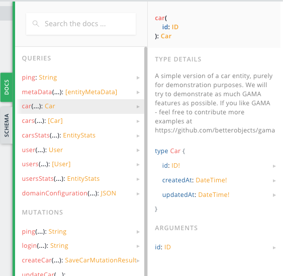

# Entity Configuration

A business domain is mainly described by its entities and their relation to each other. Think of an _entity_ as any _thing_ in your business domain. We highly recommend using a [Domain Driven Design](https://www.amazon.de/Domain-Driven-Design-Tackling-Complexity-Software/dp/B001JDYE0O) approach.

### Configuration Type

The configuration of an entity is done by an object of the following type: 

```typescript
export type EntityConfig = {

  attributes?:{[name:string]:string|AttributeConfig}
  description?:string

  assocTo?:string|(string|AssocToType)[];
  assocToMany?:string|(string|AssocToManyType)[];
  assocFrom?:string|string[]|AssocFromType[];

  seeds?:{[seedId:string]:SeedType}|SeedType[]
  validation?:( item:any, runtime:Runtime ) => ValidationReturnType
  permissions?:PermissionDelegate|EntityPermissionsType
  hooks?:EntityHooksType

  union?:string[]
  interface?:boolean
  implements?:string|string[]

  typeQuery?:false|EntityResolverFn
  typesQuery?:false|EntityResolverFn
  createMutation?:false|EntityResolverFn
  updateMutation?:false|EntityResolverFn
  deleteMutation?:false|EntityResolverFn
  statsQuery?:false|EntityResolverFn

  typeName?:string;
  plural?:string
  singular?:string;
  collection?:string;
  path?:string;
  foreignKey?:string
  foreignKeys?:string
  createInputTypeName?:string
  updateInputTypeName?:string
  filterTypeName?:string
  sorterEnumName?:string
  typeField?:string
  typesEnumName?:string
  deleteMutationName?:string
  createMutationName?:string
  updateMutationName?:string
  mutationResultName?:string
  typesQueryName?:string
  typeQueryName?:string
  statsQueryName?:string
}
```

We suggest writing the entity configuration in YAML files and simply includes these files in your [Domain Configuration](./domain-configuration).

From the definition of an _entity_ a lot of GraphQL schema types, queries and mutations are generated, incl. resolver to read and write its items to and from a _datastore_. The behaviour is strongly oppionated and uses mostly conventions; nonetheless you can configure most of the details.  You will probably only ever use the first of these configuration options, unless you know very well what do you want to achieve: 

|   |    |
| - | -- |
| [attributes](#attributes ) |  the attributes of the entity  |
| [description](#description ) |  description to add to the schema documentation  |
| [assocTo](#assocto ) |  has-one relationship to another entity  |
| [assocToMany](#assocToMany ) |  has-many relationship with references to the other entity at this entity   |
| [assocFrom](#assocFrom ) |  has-many as relationship to another entity as opposite site of a has-one or has-many relationship with references at the other entity |
| [seeds](#seeds ) |  generating seed or test data |
| [validation](#validation ) |  callback for complex or non-attribute based validation  |
| [permissions](#permissions ) |  role-based rights permission configuration  |
| [hooks](#hooks ) |  hook callbacks to customize the behaivour and result of the default queries and mutation  |
| [union](#union ) |  defines a a union relationship between entities |
| [interface](#interface ) | defines a common interface other entities can implement | |
| [implements](#implements ) |  defines the implementation of an interface entity  |

<br>

|    |    |
| -- | -- |
| [typeQuery](#typeQuery) | skip or replace default type query resolver with custom resolver |
| [typesQuery](#typesQuery) | skip or replace default types query resolver with custom resolver |
| [createMutation](#createMutation) | skip or replace default create mutation resolver with custom resolver |
| [updateMutation](#updateMutation) | skip or replace default update mutation resolver with custom resolver |
| [deleteMutation](#deleteMutation) | skip or replace default delete mutation resolver with custom resolver |
| [statsQuery](#statsQuery) | skip or replace default entity statistics query resolver with custom resolver |

<br>

|    |    |
| -- | -- |
| [typeName](#typeName) | the name of the entity object type |
| [plural](#plural) | the plural of the entity, used for generated queries and others |
| [singular](#singular) |  the singular of the entity, used for generated queries and others |
| [collection](#collection) | the name of the collection (e.g. table) in the datastore for this entity |
| [path](#path) | the name of the path in a UI (e.g. ActiveQL Admin UI)  for this entity |
| [foreignKey](#foreignKey) | the name to use as foreignKey for has-one relationships for this entity |
| [foreignKeys](#foreignKeys) | the name to use as foreignKey for has-many relationships for this entity |
| [createInputTypeName](#createInputTypeName) | the name of the GraphQL input type for the create mutatiom |
| [updateInputTypeName](#updateInputTypeName) | the name of the GraphQL input type for the update mutatiom |
| [filterTypeName](#filterTypeName) | the name of the GraphQL input type for the filter of the types query |
| [sorterEnumName](#sorterEnumName) | the name of the GraphQL enum for sorting of the types query |
| [typeField](#typeField) | the name of the GraphQL field when this entity is part of a polymorphic relationship|
| [typesEnumName](#typesEnumName) | the name of the GraphQL enum for all types that are union types of this entity or implement this entity as interface |
| [createMutationName](#createMutationName) | the name of the create mutation for this entity |
| [updateMutationName](#updateMutationName) | the name of the update mutation for this entity |
| [deleteMutationName](#deleteMutationName) | the name of the delete mutation for this entity |
| [mutationResultName](#mutationResultName) | the name of the GraphQL type that is returned for the create and update mutation |
| [typeQueryName](#typeQueryName) | the name of the type query for this entity |
| [typesQueryName](#typesQueryName) | the name of the types query for this entity |
| [statsQueryName](#statsQueryName) | the name of the stats query for this entity |


# Properties of Entity configuration


## attributes

```typescript
attributes?:{[name:string]:string|AttributeConfig}
```

The attributes of an entity as _key/value_ pairs. See
[Attribute Configuration](./attribute-configuration.md) for details.

_YAML_
```yaml
entity:    
  Car: 
    attributes: 
      brand: string!
      mileage: int
```

_Code_
```javascript
const domainConfiguration = {
  entity: {
    Car: {
      attributes: {
        brand: 'string!',
        mileage: 'int'
      }
    }
  }
}
```

## description 

```typescript
description?:string
```

You can add a description or documentation to your entity. This will become part of the schema and the public API. 

```yaml
entity: 
  Car: 
    description: >
      A simple version of a car entity, purely for demonstration purposes.
      We will try to demonstrate as much ActiveQL features as possible. 
      If you like ActiveQL - feel free to contribute more examples at
      https://github.com/betterobjects/activeql
```





## assocTo

Defines a _to one_ associaton from one entity to another. For details see _AssocTo Configuration_.

_YAML_
```yaml
entity:    
  Car: 
    attributes: 
      brand: string!
    assocTo: Trailer
  Trailer:
    attributes:
      load: int!
```

## assocToMany

Defines a _to many_ associaton from one entity to another where the ids of the _other_ entitiy are stored in the entity that holds this association. For details see _AssocToMany Configuration_.

_YAML_
```yaml
entity:    
  Car: 
    assocToMany: Driver
  Driver:
```

## assocFrom

Defines a _to many_ associaton from one entity to another where the id of the entitiy that holds this association is stored in the _other_ entity. This association needs a `assocTo` in the opposite entity. For details see _AssocFrom Configuration_.

_YAML_
```yaml
entity:    
  Car: 
    assocFrom: Driver
  Driver:
    assocTo: Car
```

## interface 

Defines an _entity_ as an _GraphQL interface_. As a convinience feature you can define attributes in an `interface` _entity_ that all _entities_ that `implement` this interface will inherit.

_YAML_
```yaml
entity:    
  Car: 
    interface: true    
    attributes:
      brand: string!
  Convertible:
    implements: Car
    attributes:
      softtop: boolean
  Sedan:
    implements: Car
    attributes:
      doors: int
```

## implements 

Defines an _entity_ `implements` an `interface` _entity_.

_YAML_
```yaml
entity:    
  Car: 
    interface: true    
    attributes:
      brand: string!
  Convertible:
    implements: Car
    attributes:
      softtop: boolean
  Sedan:
    implements: Car
    attributes:
      doors: int
```

_Schema (excerpt)_
```graphql
interface Car {
  id: ID!
  brand: String!
  createdAt: DateTime!
  updatedAt: DateTime!
}

type Convertible implements Car {
  id: ID!
  softtop: Boolean
  createdAt: DateTime!
  updatedAt: DateTime!
  brand: String!
}

type Mutation {
  deleteCar(id: ID): [String]
  createConvertible(
    convertible: ConvertibleCreateInput
  ): SaveConvertibleMutationResult
  updateConvertible(
    convertible: ConvertibleUpdateInput
  ): SaveConvertibleMutationResult
  deleteConvertible(id: ID): [String]
  createSedan(sedan: SedanCreateInput): SaveSedanMutationResult
  updateSedan(sedan: SedanUpdateInput): SaveSedanMutationResult
  deleteSedan(id: ID): [String]
}

type Query {
  cars(filter: CarFilter, sort: CarSort): [Car]
  convertible(id: ID): Convertible
  convertibles(filter: ConvertibleFilter, sort: ConvertibleSort): [Convertible]
  sedan(id: ID): Sedan
  sedans(filter: SedanFilter, sort: SedanSort): [Sedan]
}

type Sedan implements Car {
  id: ID!
  doors: Int
  createdAt: DateTime!
  updatedAt: DateTime!
  brand: String!
}
```

_GrapqhQL_
```graphql
mutation addCars {
  createSedan( sedan: { brand: "Volkswagen", doors: 4 } ){validationViolations{attribute message}}
	createConvertible( convertible: { brand: "Porsche", softtop: true }){validationViolations{attribute message}}
}
query listCars {
  cars { 
  	... on Convertible {
      softtop
    }
    ... on Sedan {
      doors
    }
    brand
    __typename 
  }
}
```

_Result_
```json
{
  "data": {
    "cars": [
      {
        "softtop": true,
        "brand": "Porsche",
        "__typename": "Convertible"
      },
      {
        "doors": 4,
        "brand": "Volkswagen",
        "__typename": "Sedan"
      },
      {
        "softtop": null,
        "brand": "Porsche",
        "__typename": "Convertible"
      },
      {
        "doors": 4,
        "brand": "Volkswagen",
        "__typename": "Sedan"
      }
    ]
  }
}
```

## union

Defines the _GraqpQL union_ of some entities. 

_YAML_
```yaml
entity:
  Convertible:
    attributes:
      brand: string
      softtop: boolean
  Sedan:
    attributes:
      brand: string
      doors: int
  Car:
    union:
      - Convertible
      - Sedan
```

_Schema (excerpt)_
```graphql
union Car = Convertible | Sedan
type Convertible {
  id: ID!
  brand: String
  softtop: Boolean
  createdAt: DateTime!
  updatedAt: DateTime!
}
type Sedan {
  id: ID!
  brand: String
  doors: Int
  createdAt: DateTime!
  updatedAt: DateTime!
}
```

_GraphQL_
```graphql
mutation addCars {
  createSedan( sedan: { brand: "Volkswagen", doors: 4 } ){ sedan: { id } }
	createConvertible( convertible: { brand: "Porsche", softtop: true }){ convertible: { id } } }
}
query listCars {
  cars { 
  	... on Convertible {
      brand
      softtop
    }
    ... on Sedan {
      brand
      doors
    }
    __typename 
  }
}
```

_Result_
```json
{
  "data": {
    "cars": [
      {
        "brand": "Porsche",
        "softtop": true,
        "__typename": "Convertible"
      },
      {
        "brand": "Volkswagen",
        "doors": 4,
        "__typename": "Sedan"
      }
    ]
  }
}
```

## seeds

Sometime you want to define some seed data to your application, you can easily initialize the data store with. 
You can configure this in the `seeds` section. 

_YAML_
```yaml
entity:
  Car:
    attributes:
      brand: string!
      licence: string!
      mileage: int
    seeds:
      - brand: Volkswagen
        licence: AA 1234
        mileage: 10000
      - brand: Mercedes
        licence: BB 2345
        mileage: 20000
      - brand: Porsche
        licence: CC 3456
        mileage: 30000
```

_GraphQL_
```graphql
mutation { 
  seed(truncate:true) 
}

query {
  cars {
    id
    brand
    licence
    mileage
  }
}
```

_Result_
```json
{
  "data": {
    "cars": [
      {
        "id": "5f5f49f1322e913ad41e6d3d",
        "brand": "Volkswagen",
        "licence": "AA 1234",
        "mileage": 10000
      },
      {
        "id": "5f5f49f1322e913ad41e6d3e",
        "brand": "Mercedes",
        "licence": "BB 2345",
        "mileage": 20000
      },
      {
        "id": "5f5f49f1322e913ad41e6d3f",
        "brand": "Porsche",
        "licence": "CC 3456",
        "mileage": 30000
      }
    ]
  }
}
```

For more details e.g. how to reference type items see [Seed Configuration](./seed-configuration.md).

## validation

_Configuration Object Only_

Some basic restrictions as `required` and `unique` attributes are always validated. In addition you can add
validation specifications to the Attribute configuration. 
Please check [Attribute Validation](./attribute-configuration.md#validation).

But sometimes you want to add entitiy validation that
is not bound to an attribute, e.g. if it reflects two or more attributes  - in this case you can add a function that 
is called everytime before entity item is created or updated. 

```typescript
export type EntityConfig  = {  
  validation?:( item:any, action:'create'|'update') => ValidationReturnType
  ...
}

export type ValidationReturnType = 
  ValidationViolation[]|string|undefined|Promise<ValidationViolation[]|string|undefined>

export type ValidationViolation = {
  attribute?:string
  message:string
}
```

Your custom method will get the item that is about to be saved and the action (either `create` or `update`) so 
you can use that in your implementation. Please note that for updates the item is complete, that means even if 
a client only attempts to update one attribute, all other existing attribute values are set prior the call to this
method. 

The validation method can return the following (or any of these as `Promise`): 
  * `undefined` or `[]` to indicate the validation passes
  * an Array of `ValidationViolation` with your validation messages (with or without the `attribute` value set)
  * a `string` with your validation message, the `attribtute` of the `ValidationViolation` would not be set then

If a `validate` method is present and returns something else but `undefined` or `[]` the validation fails and the
enitity item will not be saved. The return message (probably combined with other `ValidationViolation`
messages) will be send to the client.


For mor information please check [Validation](./validation.md).

### Example

```Typescript
export const example3:DomainConfiguration = {
  entity:{
    Car: {
      attributes: {
        brand: 'string!',
        mileage: 'int'
      },
      validation: (item:any) => (item.brand !== 'Mercedes' && item.mileage > 300000 ) ? 
        'I wouldnt believe that' : undefined
    }
  }
}
```

<table width="100%" style="font-size: 0.9em">
<tr valign="top">
<td width="50%">
  Request
</td>
<td width="50%">
  Response
</td>
</tr>
<tr valign="top">
<td width="50%">

```graphql
mutation {
  createCar( 
    car: { brand: "Kia", mileage: 310000 } 
  )
  {
    car{ id brand mileage }
    validationViolations { attribute message }
  }
}
```

</td>
<td width="50%">

```json
{
  "data": {
    "createCar": {
      "car": null,
      "validationViolations": [
        {
          "attribute": null,
          "message": "I wouldnt believe that"
        }
      ]
    }
  }
}
```

</td>
</tr>
</table>


<table width="100%" style="font-size: 0.9em">
<tr valign="top">
<td width="50%">
  Request
</td>
<td width="50%">
  Response
</td>
</tr>
<tr valign="top">
<td width="50%">

```graphql
mutation {
  createCar( 
    car: { brand: "Mercedes", mileage: 310000 } 
  )
  {
    car{ id brand mileage }
    validationViolations { attribute message }
  }
}
```

</td>
<td width="50%">

```json
{
  "data": {
    "createCar": {
      "car": {
        "id": "5fa87cc40dd707984e939524",
        "brand": "Mercedes",
        "mileage": 310000
      },
      "validationViolations": []
    }
  }
}
```

</td>
</tr>
</table>

## permissions

Role based declaration of permssions to access this entity's

```typescript
  entity: {
    Car: {
      attributes: {
        brand: 'String!',
        mileage: 'Int!',
      },
      permissions: {
        admin: true,
        manager: { read: true, create: true, update: true },
        assistant: ({action}) => action === CRUD.READ ? { brand: { $ne: 'Ferrari'} } : false
      }
    }
  }
```

You can allow/disallow access to any query and mutation (via CRUD actions) based on the role(s) of a [Principal](../activeql-principal.md) and even filter allowed entity items via _expressions_. For details see [Permissions](./permissions.md).

## typeName

The `typeName` is the name GraphqlType in the schema. Per default it is _capitalized_ `name` of this _entity_ in the  _domain configuration_. Only set this if know very well, what you want to achieve.

<table width="100%" style="font-size: 0.9em"><tr valign="top">
<td width="50%">YAML</td><td width="50%">Code</td></tr>
<tr valign="top"><td width="50%">

```yaml
entity: 
  car: 
  Driver: 
    typeName: Chauffeur
```

</td><td width="50%">

```javascript
const domainConfiguration = {
  car: {}, 
  Driver: { typeName: 'Chauffeur' }
}
```

</td></tr></table>

_Schema (excerpt)_
```graphql
type Car {
  id: ID!
  createdAt: DateTime!
  updatedAt: DateTime!
}


type Chauffeur {
  id: ID!
  createdAt: DateTime!
  updatedAt: DateTime!
}

type Mutation {
  createCar(car: CarCreateInput): SaveCarMutationResult
  updateCar(car: CarUpdateInput): SaveCarMutationResult
  deleteCar(id: ID): [String]
  createChauffeur(chauffeur: ChauffeurCreateInput): SaveChauffeurMutationResult
  updateChauffeur(chauffeur: ChauffeurUpdateInput): SaveChauffeurMutationResult
  deleteChauffeur(id: ID): [String]
}

type Query {
  car(id: ID): Car
  cars(filter: CarFilter, sort: CarSort): [Car]
  chauffeur(id: ID): Chauffeur
  chauffeurs(filter: ChauffeurFilter, sort: ChauffeurSort): [Chauffeur]
}

type SaveCarMutationResult {
  validationViolations: [ValidationViolation]!
  car: Car
}

type SaveChauffeurMutationResult {
  validationViolations: [ValidationViolation]!
  chauffeur: Chauffeur
}
```

We suggest to use the capitalized version of the type name as key in the `entity` object of the configuration.

## singular 

The `singular` of an entity is used to infere the name of the type if not stated otherwise. This name is used when refering to an instance of a type. Per default it is determined via inflection of the `name` of the _entity_ (lower letter). Only set this if you know very well what you want to achieve. 

_YAML_
```yaml
entity:
  Car: 
    attributes: 
      brand: string!
  Driver:
    attributes:
      name: string!
    assocTo: Car
```

_Schema for Car (excerpt)_
```schema
type Driver {
  car: Car
}

input DriverCreateInput {
  carId: ID
}

input DriverFilter {
  carId: IDFilter
}

input DriverUpdateInput {
  carId: ID
}

type Mutation {
  createCar(car: CarCreateInput): SaveCarMutationResult
  updateCar(car: CarUpdateInput): SaveCarMutationResult
}

type Query {
  car(id: ID): Car
}

type SaveCarMutationResult {
  car: Car
}
```

## plural 

The `plural` of an entity is used to infere the name of a list of types if not stated otherwise. Per default it is determined via inflection of the `name` of the _entity_ (lower letter). Only set this if you know very well what you want to achieve.


_YAML_
```yaml
entity:
  Car: 
    attributes: 
      brand: string!
    assocFrom: Driver
  Driver:
    attributes:
      name: string!
    assocTo: Car
```

_Schema for Driver (excerpt)_
```schema

type Car {
  drivers: [Driver]
}

type Query {
  drivers(filter: DriverFilter, sort: DriverSort): [Driver]
}
```


## collection 

The `collection` property defines the collection or database table a _data-store_ should use to read and write _entities_.

Per default this is the `plural` of the entity.

## path

The `path` property is the identfier for this entity in the UI, because it is the _path_ in the url.

Per default this is the underscore version of the `plural` of the entity.

_YAML_
```yaml
entity:    
  TransportFleet: 
    ...
```

_Result_
```javascript
// path: transport_fleets
```
