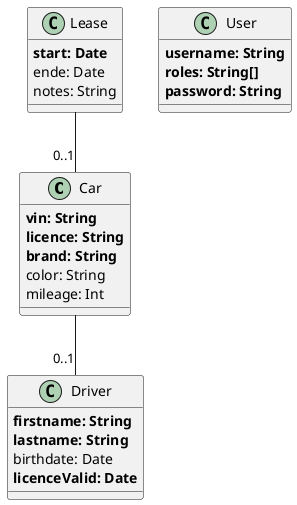

# How to generate UML from your domain configuration

You can easily generate a [PlantUML](https://plantuml.com/en/class-diagram) class diagram from your domain configuration with this command:

```
cd express
npm run uml

./domain.plantuml written
```

The content of the file `./domain.plantuml` will look something like this: 

```
@startuml domain

class Car {
  **vin: String**
  **licence: String**
  **brand: String**
  color: String
  mileage: Int
}

Car -- "0..1" Driver

class Driver {
  **firstname: String**
  **lastname: String**
  birthdate: Date
  **licenceValid: Date**
}

class Lease {
  **start: Date**
  ende: Date
  notes: String
}

Lease -- "0..1" Car

class User {
  **username: String**
  **roles: String[]**
  **password: String**
}

@enduml
```

If you use any ot the visualisation tools offered by PlantUML (e.g. the VSCode plugin) you will get the following UML class diagram: 


